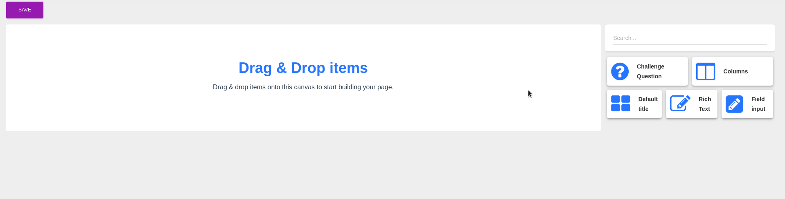

---
{
  "title": "Awesome Builder",
  "lang": "en-US"
}
---

# Awesome Builder (WIP)

The Awesome Builder allow you to quickly create page, form or what you want based on a module system

This component has two mode `edit` and `view`



## Editor Usage

Awesome Builder Editor is a fully dynamic component, all module's tiles and how they work are created from the modules you created

```vue
<template>
  <AwesomeBuilder mode="edit"/>
</template>
```

## View Usage
```vue
<template>
  <AwesomeBuilder mode="view"/>
</template>
```

## Module system is easy :tada:
::: tip
All the modules in `components/builder/modules` is automatically load by `AwesomeBuilder`
:::


## Create a module (WIP)

The Awesome Builder module system allow you to create a module that can be used in `Awesome Builder`

### Configuration

To create a new module you have to create a Vue component in `components/builder/modules`

In this component you should import `AwesomeBuilderModule` and `builderModuleMixin`

```js
import AwesomeBuilderModule from '@/components/builder/AwesomeBuilderModule';
import builderModuleMixin from '@/mixins/builderModuleMixin';

export default {
  name: 'MyModule',
  mixins: [builderModuleMixin],
  components: {AwesomeBuilderModule},
}
```

`AwesomeBuilderModule` require some props to work correctly

| Property   |     Type      |     Required    |     Usage      |
|------------|---------------|-----------------|----------------|
| uuid | `String` | `true` | Used to identify the element |
| mode | `String` | `true` | Used to determine in which mode module should display (`edit`, `show` or `tile`) |
| title | `String` | `false` | The title of the module |
| icon | `String` | `false` | The icon of the module (FontAwesome 4) |
| description | `String` | `false` | The description of the module |

::: tip
`uuid` is provided by `builderModuleMixin` in the computed property `_uuid`

`mode` is provided by `builderModuleMixin` in the property `mode` (you can override it)
:::

```vue
<AwesomeBuilderModule
    icon="fa-times"
    title="myModuleTitle"
    description="myModuleDescription"
    :uuid="_uuid"
    :mode="mode"
>
</AwesomeBuilderModule>
```

### Content

To implement the content you want in the module you can use `AwesomeBuilderModule`'s slots

All data you want to share is to placed in `insideData`

#### Editor

```vue
<AwesomeBuilderModule
        icon="fa-times"
        title="myModuleTitle"
        description="myModuleDescription"
        :uuid="_uuid"
        :mode="mode"
>
  <template v-slot:editor>
    <input v-model="insideData" type="text">
  </template>
</AwesomeBuilderModule>
```

#### View

```vue
<AwesomeBuilderModule
        icon="fa-times"
        title="myModuleTitle"
        description="myModuleDescription"
        :uuid="_uuid"
        :mode="mode"
>
  <template v-slot:view>
    {{insideData}}
  </template>
</AwesomeBuilderModule>
```