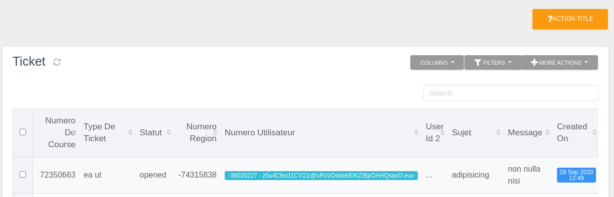
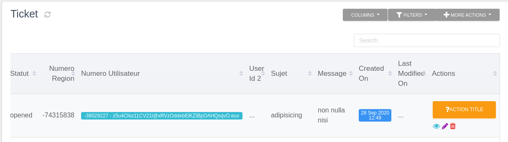
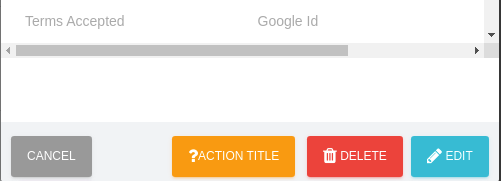
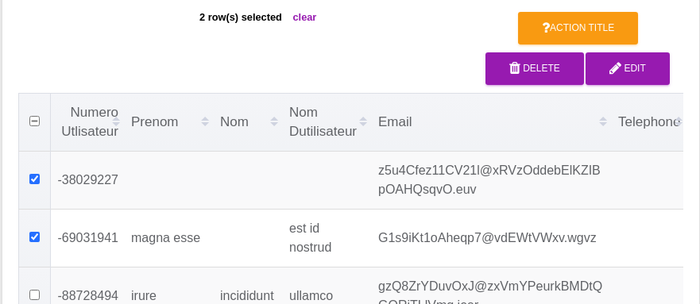
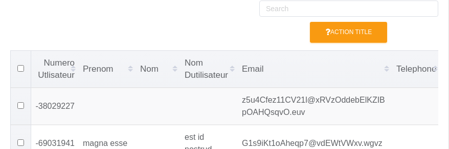
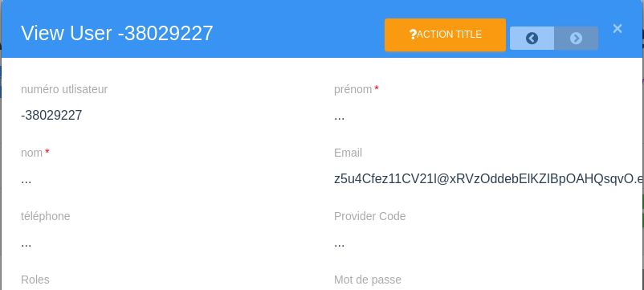

# Custom actions

In addition to the default ations on a `Awesome Crud` it's also possible to create custom actions.
The component `AwesomeAction` is used for that.

## Location

There are multiple location where you can add custom action.

| Key                     | Location                                                                       |
| ----------------------- | ------------------------------------------------------------------------------ |
| `customTopRightActions` | Actions that appears on the top right of `Awesome Crud`                        |
| `customInlineActions`   | Actions that appears in row of `Awesome Table` and in footer of `Awesome Form` |
| `customBulkActions`     | Actions that appears when you select element(s) in `Awesome Table`             |
| `customTableTopActions` | Actions that appears on top of `Awesome Table`                                 |
| `customFormTopActions`  | Actions that appears on top of `Awesome Form`                                  |
| `customTitleBarActions` | Actions that appears on in the title bar                                       |

## Props of an action

| Key            | Location                                                                                                                                           |
| -------------- | -------------------------------------------------------------------------------------------------------------------------------------------------- |
| `type`         | type of action `'button', 'dropdown', 'input', 'filter'`                                                                                           |
| `name`         | Unique Name of the action. Useful mostly to identify the action                                                                                    |
| `title`        | The text of the element. Usually used as a tooltip                                                                                                 |
| `label`        | The label of the element                                                                                                                           |
| `disabled`     | Whether the element disabled or not (boolean / Function / template )                                                                               |
| `action`       | A function you want to trigger when an action on element is fired                                                                                  |
| `actionApiUrl` | an api url to call for this action. it can contain a template. ex: '/api/salary/{{ item.id }}/recalculate'. The call is always done wia a PUT call |

For all options See https://github.com/enyosolutions-team/vue-awesome-components/blob/master/src/components/misc/AwesomeAction/AwesomeAction.vue#L115

## Locations examples

### `customTopRightActions`

```js
customTopRightActions: [
  {
    name: 'action-name',
    label: 'Action label', // or a function that return a string
    classes: 'btn-warning',
    title: 'Action title', // or a function that return a string
    icon: 'fa fa-question',
    visible: true, // or a function that return a boolean
    disabled: false, // or a function that return a boolean
    action: ({ items, action, location, props, id }, context) => {
      // Do what you want
    }
  }
];
```

`AwesomeTable`


### `customInlineActions`

```js
customInlineActions: [
  {
    name: 'action-name',
    label: 'Action label',
    classes: 'btn-warning',
    title: 'Action title',
    icon: 'fa fa-question',
    action: ({ items, action, location, props, id }, context) => {
      // Do what you want
    }
  }
];
```

`AwesomeTable`



`AwesomeForm`



### `customBulkActions`

```js
customBulkActions: [
  {
    name: 'action-name',
    label: 'Action label',
    classes: 'btn-warning',
    title: 'Action title',
    icon: 'fa fa-question',
    action: ({ items, action, location, props, id }, context) => {
      // Do what you want
    }
  }
];
```

`AwesomeTable`



### `customTableTopActions`

```js
customTableTopActions: [
  {
    name: 'action-name',
    label: 'Action label',
    classes: 'btn-warning',
    title: 'Action title',
    icon: 'fa fa-question',
    action: ({ items, action, location, props, id }, context) => {
      // Do what you want
    }
  }
];
```

`AwesomeTable`



### `customFormTopActions`

```js
customFormTopActions: [
  {
    name: 'action-name',
    label: 'Action label',
    classes: 'btn-warning',
    title: 'Action title',
    icon: 'fa fa-question',
    action: ({ items, action, location, props, id }, context) => {
      // Do what you want
    }
  }
];
```

`AwesomeForm`


## Props

<ClientOnly>
<ComponentDoc component="AwesomeAction" />
</ClientOnly>

## Types

There are 4 differents types, that you can use to display your custom action :

### `button`

This is the default type, that display only a simple button

### `dropdown`

To use this type you need to pass an array `children` with the element inside

### `filter`

Filter is a permanent `AwesomeFilter` that allow to search on model columns

### `input`

Input is a permanent `AwesomeFilter` that allow to search on what you want.

::: warning
The element you search need to be in the current model or in relation with this model

Eg: For a model `residences` that in relation with `produits` and a model `disponibilites` that in relation with `produit`, i can do:
`produits.id` or `produits.disponibilites.id` from the `residence` model.

:::

## Examples

```javascript
      customTopRightActions: [
        {
          name: 'clear-monitoring-list',
          label: 'Effacer',
          classes: 'btn-danger',
          title: 'Effacer tous les logs',
          icon: 'fa fa-trash',
          action: async ({ item }, context) => {
            if (await context.confirm('Êtes-vous de vouloir effectuer cette action')) {
              context.$http.delete('/monitoring/clear').then(() => {
                context.refreshComponent();
              });
            }
          },
        },
      ],
      customInlineActions: [
        {
          name: 'monitoring-list-new-hebergement-type',
          label: '',
          classes: 'btn-primary btn-simple',
          title: 'Créer la correspondance',
          icon: 'fa fa-edit',
          canDisplay({ item }, context) {
            return item.message && item.message.indexOf('Type d\'hebergement') > -1;
          },
          action: ({
            item, action, location, props, id,
          }, context) => {
            let data = item.context;
            const targetData = {};
            if (_.isString(data)) {
              data = JSON.parse(data);
              targetData.idMarchand = data.id_marchand;
              targetData.valeur = data.hebergement_type;
            }
            context.$router.push({
              path: '/app/correspondance/new',
              query: { item: targetData },
            });
          },
        },
      ],

```

```javascript
  customInlineActions: [{
    name: 'send-mail',
    label: 'app.buttons.contact-candidate-button',
    class: 'btn btn-sm btn-simple btn-awtable-inline-action btn-icon ml-2',
    icon: 'fa fa-envelope',
    // visible: ({ item }) => item.email,
    disabled: ({ item }) => !item.email,
    action: ({
      item, action, location, props, id,
    }, context) => {
      context.$store.dispatch('email/setShowEmailComposerModal', { show: true, recipientAdress: item && item.email });
    },
  }],
```
