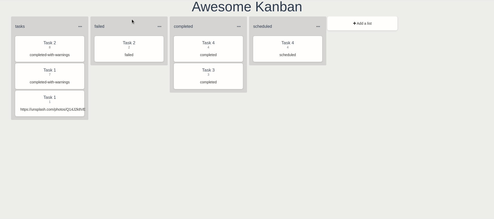

---
{
  "title": "Awesome Kanban",
  "lang": "en-US"
}
---

# Awesome Kanban

The Awesome Kanban allows you to create view in `Trello` style.



## Dependencies

* vuedraggable `npm install vuedraggable`

## Props
### lists
type: `Array (default: [], required: false)`

This is an array of object that contains all list you want to create.
The list object has 2 properties :
* `title` : `Name of the list`
* `content` : `Array of object with values`

```vue
<awesome-kanban
  :lists="lists"
/>
```

```js
//example
data: () => ({
  lists: [
    {
      title: 'Shopping List',
      content: [
        {
          id: 1,
          name: 'Banana'
        },
        {
          id: 2,
          name: 'Apple'
        },
      ]
    }
  ]
})
```

### columns
type: `Array (default: [], required: false)`
This is the columns provided by schema to display.
This allows to not display all the values in schema, only the values selected.

```vue
<awesome-kanban
  :lists="lists"
  :columns="columns"
/>
```

### kanbanOptions
type: `Object (default: defaultKanbanOptions)`

This is the configuration of the `Kanban` component.

| Property   |     Type      |     defaultValue      |     Usage      |
|------------|---------------|-----------------------|----------------|
| scrollSensitivity | `Number` | `200` | Value to determine the scroll sensitivity |
| animation | `Number` | `200` | Duration in milliseconds of the moved animation |
| moveList | `Number` | `false` | Allow you enabling/disabling list moving |
| moveCard | `Number` | `true` | Allow you enabling/disabling card moving |
| fields | `Object` | `{ title: 'name', 'subtitle': 'id', 'description': 'status' }` | Allows you to define which field you want display |
| filterField | `String` | `status` | Allow you to create default list |
| filterValues | `Array` | `['failed', 'completed', 'scheduled']` | Allow you to determine which value is used to create a list |
| sortField | `String` | `id` | Allow you to change to default sort the list by a `Fields`. |
| sortOrder | `String` | `DESC` | Allow you to change the sort order. Link with `sortField`. |
    
## Events
### @removeList
Event emitted when a list is removed
Return list name.
```vue
<awesome-kanban
   :lists="lists"
   :columns="columns"
   @removeList="onListRemoved"
/>
```
```js
methods: {
  onListRemoved(listName) {
    //
  }
}
```
### @listChanged
Event emitted when a list is changed. 
```vue
<awesome-kanban
   :lists="lists"
   :columns="columns"
   @listChanged="onListChanged"
/> 
```
```js
methods: {
  onListChanged(event) {
    // event = { moved: { element: { content: [], title:"Shopping list" }, newIndex: 3, oldIndex: 2} }
  }
}
```
### @cardChanged
Event emitted when a card is moved/changed/sorted.
```vue
<awesome-kanban
  :lists="lists"
  :columns="columns"
  @cardChanged="onCardChanged"
/>
```
```js
methods: {
  onCardChanged(event) {
    // event = [{ removed: { element: { value, ... }, oldIndex: 1 }, "list_name"]
  }
}
```
### @cardClicked
Event emitted when a card is clicked.
```vue
<awesome-kanban
  :lists="lists"
  :columns="columns"
  @cardClicked="onCardClicked"
/>
```
```js
methods: {
  onCardClicked(item) {
    // item = [{ id: 1, name: 'test', ... }]
  }
}
```
### @customListAction
Event emitted when a custom list action is clecked.
For the button to appear :
* The special `ACTIONS` must be added to the `kanbanOptions`.

The `@customListAction` event return an object with various properties to help you treat the action.

| Property   |     Type      |     Usage      |
|----------|---------------|---------------|
| action | Object | the action definition that was passed at the creation of the action |
| location | string | The location of the action |
| item | Object | the object being clicked on if the action is an inline action |
| id | string | the unique id of the button being clicked on (its basically the name of the action plus the index of the row) |

```vue
<awesome-kanban
  :lists="lists"
  :columns="columns"
  @customListAction="onCustomListAction"
/>
```
```js
methods: {
  onCustomListAction(body) {
    const { action } = body;
    this.$emit(this.identity + "-custom-list-action", action);
    return action && action.action && action.action(body, this);
  }
}
```