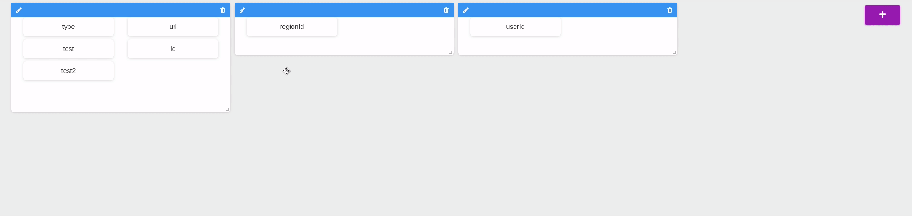

---
{
  "title": "Awesome Layout",
  "lang": "en-US"
}
---

# Awesome Layout

The Awesome Layout allows you to quickly modify the layout of a list of `Fields`



## Dependencies

* vue-grid-layout `npm install vue-grid-layout`
* vuedraggable `npm install vuedraggable`

## Configuration

The configuration layout is defined in the entity model in a `formOptions` object.

```js
formOptions: {
  layout: [
    {
      "x": 0, "y": 0, "w": 6, "h": 12, "i": 0,
      fields: ['type', 'regionId', 'userId'],
      legend: 'Identity',
    },
    {
      "x": 6, "y": 0, "w": 6, "h": 12, "i": 1,
      fields: ['subject', 'body', 'userId', 'lastModifiedOn', 'createdOn'],
      legend: 'Stakeholders'
    },
  ]
}
```
###  Layout Configuration

The layout system use `vue-grid-layout`.

| Property   |     Type      |     Required    |     Usage      |
|------------|---------------|-----------------|----------------|
| x | `Number` | `true` | Initial horizontal position of the item |
| y | `Number` | `true` | Initial vertical position of the item |
| w | `Number` | `true` | Initial width of the item. |
| h | `Number` | `true` | Initial height of the item. |
| i | `Number` | `true` | Unique identifier of the item. (auto generated) |
| fields | `Array` | `false` | The fields is identified by the key. (eg: `['id', 'name']`) |
| legend | `String` | `false` | It is displayed on top of the layout. |

## Props

### layout
type : `Array (required: true)`

The default layout used to manage can be empty array.

```vue
<awesome-layout
  :layout="layout"
/>
```

### fieldsList

type: `Array (required: false)`

A list of the available list (provided by default by the schema)

```vue
<awesome-layout
  :layout="layout"
  :fields-list="fieldsList"
/>
```

### editMode
type : `Boolean (default: false)`

Allow you to enable/disabled edit mode

```vue
<awesome-layout
  :edit-mode="true"
  :layout="layout"
/>
```

## Events

### @layout-updated
Event emitted when a layout is changed/moved/resized
This event return an array of object with all the layout.

```vue
<awesome-layout
  :edit-mode="true"
  :layout="layout"
  @layout-updated="onLayoutUpdated"
/>
```

```js
methods: {
  onLayoutUpdated(layout) {
    // eg :
    // [{"x": 0, "y": 0, "w": 6, "h": 12, "i": 0, fields: ['id'], legend: 'Identity}]               
  }     
}
```

### @layout-fields-updated
Event emmitted when a field is moved/sorted
This event return an object for each action (added, removed, moved, ...)
```vue
<awesome-layout
  :edit-mode="true"
  :layout="layout"
   @layout-fields-updated="onLayoutFieldsUpdated"
/>
```
```js
methods: {
  onLayoutFieldsUpdated(item) {
    // eg :
    // Added : { added: { element: "name", newIndex: 2 } }
    // Removed : { removed: { element: "name", oldIndex: 2 } }
    // Moved : { moved: { element: "name", newIndex: 3, oldIndex: 2} }
  }
}
```

## Fields Slot

If you want to add specific component to display fields, you can use the `fields` slot.

```vue
<awesome-layout
  :edit-mode="true"
  :layout="layout"
>
  <template v-slot:field="slotProps">
    <div class="special-class">
      {{slotProps.field}}
    </div>
  </template>
</awesome-layout>
```

