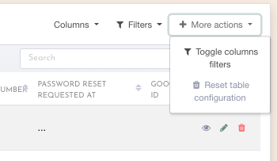

# Saving config state

Often you'll find yourself navigating back and forth between a table view and a detail view, exampel when you are checking quickly some details.

In those cases, if you had some pagination / sorting / columns in place , you end up losing them (ex: you are on page 5 and you navigate to view an item and then you go back and end up on page 1).

## Enters state saving

In order to avoid those issues, `Àwesometable` allows you to save the state of your config in sessionStorage.

You can  save the columns or/and the pagination. Sort order and filters are coming soon.

## Reseting state

if for some reason the state saved is not working or does not suits you, you can delete it at any time using the the clear state option.

## props

The following props are `false` by default.

<ClientOnly>
<ComponentDoc :component="'AwesomeTable'" :properties="['saveColumnsState', 'savePaginationState']"/>
</ClientOnly>
